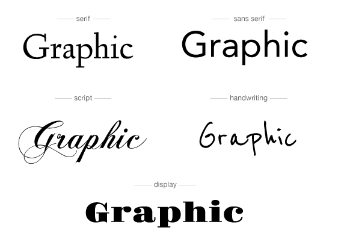

# FONTS

Graphic design is hollow without good knowledge of fonts, using good fonts is a must to be more creative and bring traffic to your design.

## Getting Started
watch this [here](https://www.youtube.com/watch?v=obZX8oIjia4) to get an idea of what to use when.

## Types of fonts
 
Sans Seriff
 
a sans-serif, sans serif, gothic, or simply sans letterform is one that does not have extending features called "serifs" at the end of strokes. For example : Arial , Arciform.
Use Sans seriff for most of your projects including UI/UX , some fonts to be noted are Montserrat, Roboto and Raleway.
  
Seriff
 
a serif (/ˈsɛrɪf/) is a small line or stroke regularly attached to the end of a larger stroke in a letter or symbol within a particular font or family of fonts. For example : Times new roman
  
Slab-seriff
 
a slab serif (also called mechanistic, square serif, antique or Egyptian) typeface is a type of serif typeface characterized by thick, block-like serifs.  For example : Bitter , Aleo
  
Calligraphic
 
Calligraphy (from Greek: καλλιγραφία) is a visual art related to writing. It is the design and execution of lettering with a broad-tipped instrument, brush, or other writing instrument.For example : Alex Brush
  
Handwritten
 
These are the fonts which cannot be classified under any of th above fonts since they don't have a fixed way. For example : Trash hand
 
  
-Some awesome fonts are : Montserrat, Josefine Sans, Raleway, Roboto UI
 
-All these fonts are available (https://fonts.google.com/)
 
-Some great websites for fonts are (https://www.fontsquirrel.com/) , (https://www.fontfabric.com/fonts/) , (https://www.dafont.com/) , (https://www.1001fonts.com/)
 
 

if you still can't find a font then just google search it

We hope you now know the roadmap to being a professional Graphic Designer :v:
